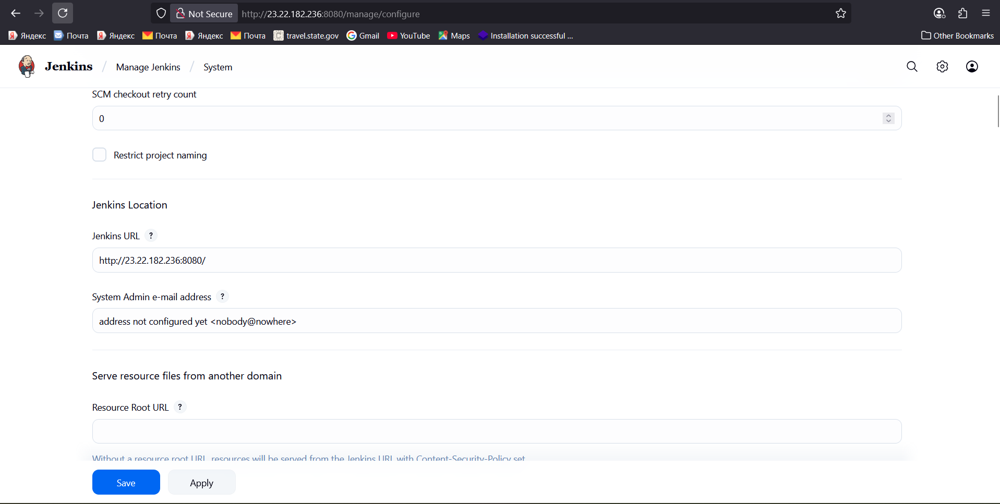

# 🔄 Steps to Update Jenkins URL When Public IP Changes



### 🖥️ Update Jenkins URL

1. Log in to Jenkins → Go to `http://<new_public_ip>:8080/`.
2. Navigate: **Manage Jenkins → System**.
3. Find **“Jenkins Location”** section.
4. Update the **Jenkins URL** field → replace the old IP with the **new public IP** (or, better, use a stable domain like `http://jenkins.example.com/`).
5. *(Optional but recommended)* Add a **System Admin e-mail address** for alerts.
6. Click **Save** at the bottom.
7. Test access → open a new browser tab and confirm Jenkins loads correctly with the updated URL.

---

### 🛠️ Why This Update Is Important

* 🔗 **Redirects** → Jenkins generates absolute links (login, job pages, builds, CSS/JS). If outdated, browser chases the wrong address.
* 🤖 **Webhooks & Agents** → GitHub/GitLab webhooks & Jenkins agents use this URL for callbacks. Wrong IP breaks them.
* 🛡️ **Security headers** → Jenkins validates requests against this URL. Mismatch triggers warnings (*Reverse proxy setup is broken*).
* 📧 **Notifications & Emails** → Jenkins emails will include links pointing to the wrong host.

---

### 🐢 Why It Makes Jenkins “Slow”

1. Jenkins pages embed **old IP links** for resources.
2. Browser tries to fetch from old IP → request **fails/timeouts**.
3. Only after retry/fallback does browser fetch correct content.
4. ❌ Leads to delayed page loads, broken assets & sluggish performance.

⚡ Every failed fetch = wasted seconds = **“slow Jenkins.”**

---

### ✅ Best Practice

* Use a **static IP (Elastic IP in AWS)** or a **DNS name** (`jenkins.mydomain.com`).
* Then you only update **DNS**, not Jenkins config.

---

# 🌐 Domain + Reverse Proxy + SSL for Jenkins

### 1️⃣ Get a Domain Name

* Register (e.g., `myjenkins.site`).
* In DNS: Create **A record** → `jenkins.myjenkins.site` → your AWS VM public IP.
* TTL: 300 (5 mins).

### 2️⃣ Install Nginx on AWS VM

```bash
sudo apt-get update -y
sudo apt-get install -y nginx
```

### 3️⃣ Configure Nginx Reverse Proxy

```nginx
server {
    listen 80;
    server_name jenkins.myjenkins.site;

    location / {
        proxy_pass         http://127.0.0.1:8080;
        proxy_set_header   Host              $host;
        proxy_set_header   X-Real-IP         $remote_addr;
        proxy_set_header   X-Forwarded-For   $proxy_add_x_forwarded_for;
        proxy_set_header   X-Forwarded-Proto $scheme;
        proxy_read_timeout 90;
    }
}
```

Enable & restart:

```bash
sudo ln -s /etc/nginx/sites-available/jenkins /etc/nginx/sites-enabled/
sudo nginx -t
sudo systemctl restart nginx
```

### 4️⃣ Update Jenkins URL

Set Jenkins URL to:

```
https://jenkins.myjenkins.site/
```

### 5️⃣ Install Let’s Encrypt SSL

```bash
sudo apt-get install -y certbot python3-certbot-nginx
sudo certbot --nginx -d jenkins.myjenkins.site
sudo certbot renew --dry-run
```

### 6️⃣ Verify Access

* Open `https://jenkins.myjenkins.site`
* 🔒 Browser shows **secure padlock**
* Jenkins now serves via **Nginx (443)**, hiding internal `8080`.

---

# ⚡ Benefits

✅ No more IP headaches → Only DNS needs updating.
✅ Secure (HTTPS) → Free Let’s Encrypt SSL.
✅ Reverse proxy flexibility → Add firewall, rate limiting, load balancing later.
✅ Clean URL → `https://jenkins.myjenkins.site` instead of `http://<ip>:8080`.
