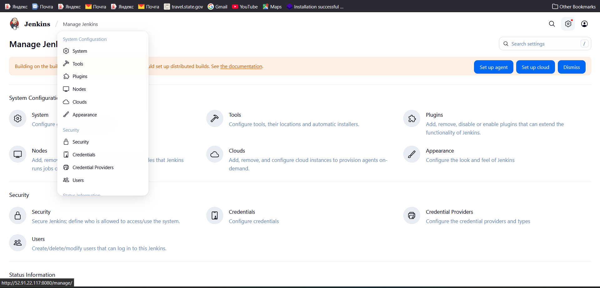

# 🧰✨ Jenkins Installation and Configuration Guide

## ☁️ AWS Setup Guide with Security Group & EC2

### 🔐 Create a Security Group & Open Ports

1. **Login to AWS Console** → Navigate to **EC2 Dashboard**.
2. **Security Groups** → Click **Create Security Group**.
3. **Fill in details:**

   * 📛 **Name** → e.g., `my-security-group`
   * 📝 **Description** → "Allow web, SSH, and mail traffic"
   * 🌍 **VPC** → Select your desired VPC.
4. **Add Inbound Rules:**

   * 🔒 **465 → SMTPS**
   * ⚙️ **3000 – 11000 → Custom TCP**
   * 📨 **587 → Custom TCP**
   * 🌐 **80 → HTTP**
   * 🛡️ **443 → HTTPS**
   * 🔑 **22 → SSH**
5. **Save** the security group ✅

---

### 🖥️ Launch an EC2 Instance with Existing SG

1. From **EC2 Dashboard**, click **Launch Instance**.
2. **Choose AMI** → e.g., Amazon Linux 2, Ubuntu, etc.
3. **Choose Instance Type** → e.g., `t2.micro` (Free Tier eligible).
4. **Configure Instance:**

   * ⚙️ Default settings unless you need custom networking.
5. **Add Storage** → Default or increase as needed.
6. **Configure Security Group:**

   * Select **Use existing security group**
   * ✅ Choose the one you created earlier (`my-security-group`).
7. **Key Pair** → Select or create a new key pair 🔑.
8. **Review and Launch** 🚀.

---

✨ Now your EC2 instance is running with the security group that has the necessary ports open!


## ✅ Prerequisites

Before installing Jenkins, ensure that **☕ Java** is installed on your system. Jenkins requires Java to run.

**📦 Install OpenJDK 17:**

```bash
sudo apt install openjdk-21-jre-headless -y # Java 21 runtime only (headless)

sudo apt install openjdk-21-jdk -y # Full JDK (compiler + JRE)
```

💡 This installs the necessary Java Runtime Environment to ensure Jenkins functions correctly.

---

## 📥 Installing Jenkins

### 🧾 Step 1️⃣: Create a Script for Installation

Create a shell script to automate the installation process. This script will **⬇️ download the Jenkins key**, **🧰 add the Jenkins repository**, and **📦 install Jenkins**.

1. **Create a script file named `install-jenkins.sh`:**

[Just copy and paste the link](https://www.jenkins.io/doc/book/installing/linux/#debianubuntu)

   ```bash
   vi install-jenkins.sh
   ```
2. **Copy the following content into the script:**

   ```bash
   #!/bin/bash
   sudo wget -O /usr/share/keyrings/jenkins-keyring.asc \
   https://pkg.jenkins.io/debian-stable/jenkins.io-2023.key
   echo deb [signed-by=/usr/share/keyrings/jenkins-keyring.asc] \
   https://pkg.jenkins.io/debian-stable binary/ | sudo tee \
   /etc/apt/sources.list.d/jenkins.list > /dev/null
   sudo apt-get update
   sudo apt-get install jenkins
   ```

### 🔐 Step 2️⃣: Set Permissions and Run the Script

1. **Make the script executable:**

   ```bash
   sudo chmod +x install-jenkins.sh
   ```
2. **Execute the script to install Jenkins:**

   ```bash
   ./install-jenkins.sh
   ```

🚀 This automates the installation, making it easier to deploy Jenkins on your server.

### Start Jenkins
You can enable the Jenkins service to start at boot with the command:
```sh
sudo systemctl enable jenkins
```
You can start the Jenkins service with the command:
```sh
sudo systemctl start jenkins
```
You can check the status of the Jenkins service using the command:
```sh
sudo systemctl status jenkins
```

## 🌐 Accessing Jenkins

Once Jenkins is installed, it can be accessed through a web browser.

1. **🌍 Open Jenkins:** Use your server's public IP address and port **8080**
```sh
   http://your_public_ip:8080`
   http://52.91.22.117:8080/manage/
```
2. **🔑 Retrieve the initial admin password:**

```bash
sudo cat /var/lib/jenkins/secrets/initialAdminPassword
```

This password lets you log in and complete the Jenkins setup 

password: nakod1234

## 🔌 Installing Plugins & ⚙️ Configuring JDK

### 🧩 Step 1️⃣: Installing Plugins

1. Navigate to **Manage Jenkins → Manage Plugins**.
2. Under the **Available** tab, search for **"Eclipse Temurin Installer"**.
3. **⬇️ Install** the plugin.



Restart jenkins and login

### ☕ Step 2️⃣: Configuring JDK

1. Go to **Manage Jenkins → Global Tool Configuration → JDK installations**.
2. Add a JDK installation:

   * 🏷️ Provide a name for the JDK.
   * ✅ Select **"Install automatically"**.
   * 🌐 Choose **"Install from adoptium.net"** and configure **JDK 21**.

This ensures your Jenkins instance can use **JDK 21** for various tasks.

After installing any tool, that tool will show at the tools section 

>[!NOTE] 
At the tools section, you can configure different version of the plugin


## Setup Nodes (agents)


[🤖 Jenkins Master (Controller) and Agents (Slaves)](./Jenkins%20Master–Agent%20with%20Docker%20—%20Best‑Practice%20Notes.md)

### How to create new node
[How to create new node and setup](./Agent%20Setup%20on%20AWS%20EC2.md)

## 🧱 Jenkins Job Types

Different job types help automate stages of the software development lifecycle:

1. **🧱 Freestyle Project**

   * Define a series of build steps (run shell commands, scripts, etc.).
   * Great for simple tasks and projects that don't require complex workflows.
2. **🛠️ Pipeline Project**

   * Use the Pipeline plugin to define build/test/deploy **as code** with a `Jenkinsfile`.
   * Supports **Declarative** and **Scripted** pipelines for highly customizable workflows.
3. **🌿 Multibranch Pipeline**

   * Automatically creates sub-jobs for each branch in your VCS repository.
   * Ideal for managing CI/CD across multiple branches.


## 🧪 Creating and Configuring a Freestyle Jenkins Job

Creating and configuring a Jenkins Freestyle job is straightforward. Follow these steps:

### 🔐 Step 1️⃣: Access Jenkins

1. Log in to the Jenkins web interface.

### 🆕 Step 2️⃣: Create a New Freestyle Job

1. Click **"New Item"** on the Jenkins dashboard.
2. Enter a name (e.g., **"MyFreestyleJob"**).
3. Select **"Freestyle project"** and click **"OK"**.

[Jenkins Agent Ping Tests](./Jenkins%20Agent%20Ping%20Tests.md)

[Job: first-job — Build Steps & Key Settings](./Job%20first-job%20—%20Build%20Steps%20&%20Key%20Settings.md)

[ Essential Server Setup Cheatsheet](./Essential%20Server%20Setup%20Cheatsheet.md)

[🛠️ Infra & Monitoring Tools Installation Guide]

### 🧾 Step 3️⃣: Configure General Settings

1. In **"General"**:

   * 📝 Add a brief description (optional).
   * 🗃️ Enable **"Discard old builds"** to manage build retention.

### 🔗 Step 4️⃣: Configure Source Code Management (Optional)

1. Choose the SCM system (**Git, Subversion, etc.**) and provide repository details.

### 🛠️ Step 5️⃣: Configure Build Steps (Continued)

Choose any steps needed for your project:

1. **🖥️ Execute Shell:** Run shell commands or scripts.
2. **🪟 Execute Windows Batch Command:** Run batch commands on Windows.
3. **🐜 Invoke Ant:** Run Apache Ant tasks.
4. **🧱 Invoke Gradle:** Run Gradle build tasks.
5. **☕ Invoke Maven:** Run Maven build tasks.

💡 For Java projects, **Invoke Maven** is commonly used to compile and build code.

### 📦 Step 6️⃣: Configure Post-Build Actions

After the build completes, you can:

1. **🗂️ Archive the Artifacts:** Save JARs/reports for future reference.
2. **🧪 Publish JUnit Test Result Report:** View test results within Jenkins.
3. **🔐 Send Build Artifacts Over SSH:** Transfer artifacts to a remote server for deployment or further processing.

### ⏱️ Step 7️⃣: Configure Build Triggers (Optional)

Automate when builds start:

1. **🗓️ Build Periodically:** Schedule (e.g., nightly builds).
2. **🔍 Poll SCM:** Detect changes in the repository and trigger builds.

### 💾 Step 8️⃣: Save Configuration

Click **"Save"** to persist your job settings.

### ▶️ Step 9️⃣: Run the Job

Click **"Build Now"** to start the build process.

### 📊 Step 🔟: View Build Results

See console output, artifacts, and test results under **"Build History"** on the job page.

# 🧪 Jenkins Pipeline Job (Declarative)

Here’s a more detailed explanation of a Jenkins pipeline job using the **Declarative Pipeline** syntax:

[Jenkins Pipelines](./Jenkins%20Pipelines.md)

[Jenkins — Pipeline from SCM (Git) Notes](./Jenkins%20—%20Pipeline%20from%20SCM%20(Git)%20Notes.md)

## 📦 Example: Simple Maven Pipeline

This pipeline includes stages for **checking out code**, **compiling**, **testing**, and **packaging** a Maven project:

```groovy
pipeline {
    agent any
    tools {
        jdk 'jdk_name'
        maven 'maven_name'
    }
    stages {
        stage('Checkout') {
            steps {
                // Check out the source code from the repository
                git branch: 'main', url: 'https://github.com/your/repo.git'
            }
        }
        stage('Compile') {
            steps {
                // Compile the code using Maven
                sh 'mvn compile'
            }
        }
        stage('Test') {
            steps {
                // Run tests using Maven
                sh 'mvn test'
            }
        }
        stage('Package') {
            steps {
                // Package the application using Maven
                sh 'mvn package'
            }
        }
    }
    post {
        always {
            // Archive the build artifacts
            archiveArtifacts artifacts: '**/target/*.jar', allowEmptyArchive: true
        }
    }
}
```

---

## 🧭 Explanation

1. **Agent** 🧑‍💻: `agent any` tells Jenkins to run the pipeline on **any available agent**.
2. **Tools** 🧰: The `tools` block specifies the required tools (JDK & Maven). Replace **`jdk_name`** and **`maven_name`** with the actual tool names configured in Jenkins.
3. **Stages** 🏁: The `stages` block defines CI/CD steps:

   * **Checkout** 🔄: Checks out the source code from the Git repository.
   * **Compile** 🛠️: Compiles the source code using Maven.
   * **Test** ✅: Runs tests using Maven.
   * **Package** 📦: Packages the application (e.g., creates a JAR file).
4. **Post** 📤: The `post` block runs actions after the pipeline finishes. Here it **archives build artifacts**, making them downloadable from Jenkins.

---

## 🧙‍♂️ Customization

* 🔗 Replace `https://github.com/your/repo.git` with your **actual Git repository URL**.
* 🧩 Ensure **Maven (`mvn`)** is installed and available on the agent running this pipeline.

This pipeline provides a clear, structured way to **automate build, test, and package** steps for your Maven project.

---

# 🌐 Triggering a Pipeline via Generic Webhook Trigger

## 🔌 Step 1: Install **Generic Webhook Trigger** Plugin

1. Go to **Jenkins dashboard**.
2. Navigate to **Manage Jenkins → Manage Plugins**.
3. In the **Available** tab, search for **"Generic Webhook Trigger"**.
4. **Install** the plugin and **restart Jenkins** if necessary.

## ⚙️ Step 2: Configure Jenkins Job

1. Create or open the Jenkins job you want to trigger.
2. In the job configuration, scroll to **Build Triggers**.
3. Check **Generic Webhook Trigger** ✅.

## 📨 Step 3: Configure **Post Parameters**

* **Variable:** `ref`
* **Expression (JSON):** `$.ref`

## 🔑 Step 4: Write a **Token**

* Provide any keyword string as a **token** to be used in the webhook URL.

## 🧪 Step 5: Configure **Optional Filter**

* **Expression:** `refs/heads/branch_name` *(replace `branch_name` with your branch)*
* **Text:** `$ref`

## 🐙 Step 6: Configure **GitHub Webhook**

1. Go to your **GitHub repository → Settings → Webhooks**.
2. Click **Add webhook**.
3. **Payload URL:**

   ```
   Jenkins_URL/generic-webhook-trigger/invoke?token=github_token
   ```

   Replace `Jenkins_URL` with your Jenkins URL and `github_token` with the token you set.
   **Example:**
   `http://65.0.31.109:8080/generic-webhook-trigger/invoke?token=github_token`
4. **Content type:** `application/json`
5. **Events:** Select events to trigger the webhook (e.g., **Pushes**).

## 💾 Step 7: Save Changes

* Save the Jenkins job configuration.
  Now your job will trigger via webhook whenever a **push event** occurs on the specified branch.

---

# 🌿 Multibranch Pipeline: Webhook Scans

[Jenkins Multibranch Pipeline](./Jenkins%20Multibranch%20Pipeline.md)

## 🔌 Step 1: Install **Multibranch Scan Webhook Trigger** Plugin

1. **Jenkins dashboard** → **Manage Jenkins → Manage Plugins**.
2. In **Available**, search for **"Multibranch Scan Webhook Trigger"**.
3. **Install** and **restart** if required.

## 🧭 Step 2: Configure **Multibranch Pipeline Job**

1. Create or open your **Multibranch Pipeline** job.
2. Go to **Scan Multibranch Pipeline Triggers**.
3. Select **Scan by webhook**.
4. Enter any **Trigger token** in the field.

## 🐙 Step 3: Configure **GitHub Webhook**

[Git Branch Management](./Webhook/Git%20Branch%20Management.md)

1. **GitHub → Repository Settings → Webhooks → Add webhook**.
2. **Payload URL:**

```sh
Jenkins_URL/multibranch-webhook-trigger/invoke?token=token_value
```

   Replace `Jenkins_URL` with your Jenkins URL and `token_value` with the token you set.
   **Example:**
   `http://65.0.31.109:8080/multibranch-webhook-trigger/invoke?token=Devopsshack`
3. **Content type:** `application/json`
4. **Events:** Choose events (e.g., **Pushes**).

## 💾 Step 4: Save Changes

* Save the Multibranch Pipeline job configuration.
  Now your **Multibranch Pipeline** will scan/trigger via webhook whenever a **push** occurs on your GitHub repository.
