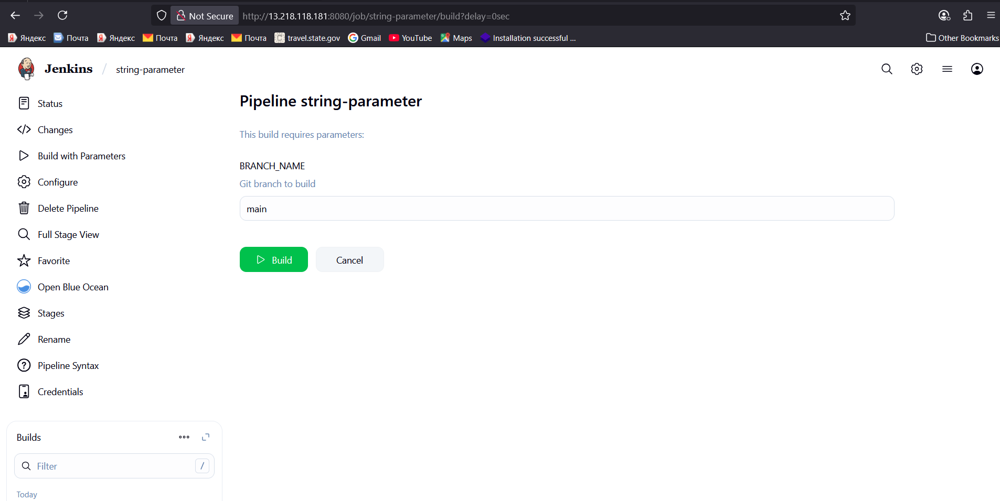
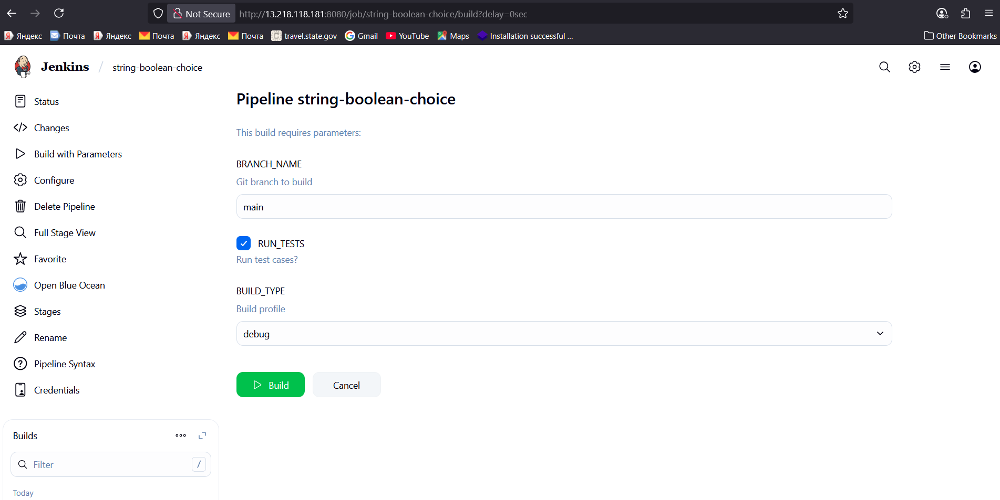
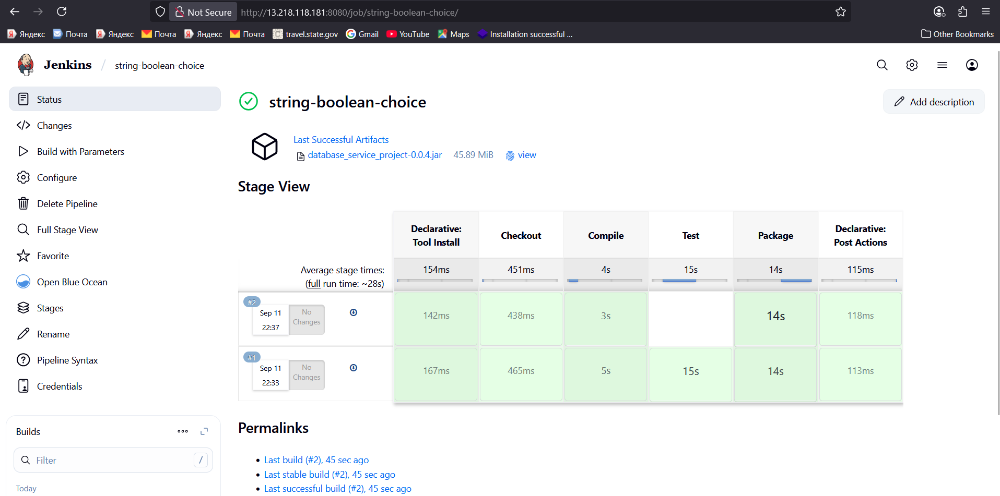

# 🧩 Jenkins Pipeline Parameters — String, Boolean, Choice

Parameters let you **ask for input at build time** (e.g., branch, run tests?, build type) and then use those values inside your Pipeline.

> Where you see them: click **Build with Parameters** on the job.

---

## 🔤 Parameter Types (quick intro)

* **`string`** → free‑text input (e.g., Git branch name).
* **`booleanParam`** → checkbox **true/false** (e.g., run tests?).
* **`choice`** → drop‑down from a fixed list (e.g., `debug` / `release`).

Add them in a `parameters { ... }` block at the top of your Jenkinsfile.

---

## 🧪 Baseline Pipeline (your example)

This one **does not** use parameters yet; it compiles, tests, and packages.

```groovy
pipeline {
  agent any
  
  tools {
    maven 'Maven-3.9.11'
    jdk   'jdk17'
  }

  stages {
    stage('Checkout') {
      steps {
        // Check out the source code from the repository
        git branch: 'main', url: 'https://github.com/bernardofosu/Boardgame-with-Jenkins-MultiPipeline.git'
      }
    }

    stage('Compile') {
      steps { sh 'mvn compile' }
    }

    stage('Test') {
      steps { sh 'mvn test' }
    }

    stage('Package') {
      steps { sh 'mvn package' }
    }
  }

  post {
    always {
      archiveArtifacts artifacts: '**/target/*.jar', allowEmptyArchive: true
    }
  }
}
```

---

## 1) 🔤 `string` parameter (branch selector)

Use a string to pick the Git branch. The **first build uses the default**; after that you can choose a different branch in **Build with Parameters**.

```groovy
pipeline {
  agent any
  tools { maven 'Maven-3.9.11'; jdk 'jdk17' }

  parameters {
    string(name: 'BRANCH_NAME', defaultValue: 'main', description: 'Git branch to build')
  }

  stages {
    stage('Checkout') {
      steps {
        git branch: "${params.BRANCH_NAME}", url: 'https://github.com/bernardofosu/Boardgame-with-Jenkins-MultiPipeline.git'
      }
    }
    stage('Compile') { steps { sh 'mvn compile' } }
    stage('Test')    { steps { sh 'mvn test'    } }
    stage('Package') { steps { sh 'mvn package' } }
  }

  post { always { archiveArtifacts artifacts: '**/target/*.jar', allowEmptyArchive: true } }
}
```



---

## 2) ✅ `booleanParam` (toggle tests on/off)

Checkbox to decide whether to run tests. We gate the stage with `when { expression { ... } }`.

```groovy
pipeline {
  agent any
  tools { maven 'Maven-3.9.11'; jdk 'jdk17' }

  parameters {
    booleanParam(name: 'RUN_TESTS', defaultValue: true, description: 'Run test cases?')
  }

  stages {
    stage('Checkout') { steps { git branch: 'main', url: 'https://github.com/bernardofosu/Boardgame-with-Jenkins-MultiPipeline.git' } }
    stage('Compile')  { steps { sh 'mvn compile' } }

    stage('Test') {
      when { expression { return params.RUN_TESTS } }
      steps {
        sh 'mvn test'
      }
    }

    stage('Package') { steps { sh 'mvn package' } }
  }

  post { always { archiveArtifacts artifacts: '**/target/*.jar', allowEmptyArchive: true } }
}
```

---

## 3) 🎛️ `choice` (build type / profile)

Drop‑down to select a Maven profile; the choice value is appended to `-P`.

```groovy
pipeline {
  agent any
  tools { maven 'Maven-3.9.11'; jdk 'jdk17' }

  parameters {
    choice(name: 'BUILD_TYPE', choices: ['debug', 'release'], description: 'Choose the build type/profile')
  }

  stages {
    stage('Checkout') { steps { git branch: 'main', url: 'https://github.com/bernardofosu/Boardgame-with-Jenkins-MultiPipeline.git' } }
    stage('Compile')  { steps { sh 'mvn compile' } }
    stage('Test')     { steps { sh 'mvn test'    } }

    stage('Package') {
      steps {
        sh "mvn package -P${params.BUILD_TYPE}"
      }
    }
  }

  post { always { archiveArtifacts artifacts: '**/target/*.jar', allowEmptyArchive: true } }
}
```

---

## 🧷 Final Example — **Combine all three**

String + Boolean + Choice working together.

```groovy
pipeline {
  agent any
  tools { maven 'Maven-3.9.11'; jdk 'jdk17' }

  parameters {
    string(name: 'BRANCH_NAME',  defaultValue: 'main',   description: 'Git branch to build')
    booleanParam(name: 'RUN_TESTS', defaultValue: true,    description: 'Run test cases?')
    choice(name: 'BUILD_TYPE',   choices: ['debug', 'release'], description: 'Build profile')
  }

  stages {
    stage('Checkout') {
      steps {
        git branch: "${params.BRANCH_NAME}", url: 'https://github.com/bernardofosu/Boardgame-with-Jenkins-MultiPipeline.git'
      }
    }

    stage('Compile') { steps { sh 'mvn -B -ntp compile' } }

    stage('Test') {
      when { expression { return params.RUN_TESTS } }
      steps { sh 'mvn -B -ntp test' }
    }

    stage('Package') {
      steps { sh "mvn -B -ntp package -P${params.BUILD_TYPE}" }
    }
  }

  post {
    always { archiveArtifacts artifacts: '**/target/*.jar', allowEmptyArchive: true }
  }
}
```
### Quick Groovy tips (vs JS/JSON)

Strings: 'single' or "double"; interpolation only in double:
```sh
def branch = 'main'
string(name: 'BRANCH_NAME', defaultValue: "${branch}") // works
string(name: 'BRANCH_NAME', defaultValue: '${branch}') // literal ${branch}
```
Trailing commas are generally fine in parameter lists.

This DSL ultimately creates Jenkins ParameterDefinitions; you're calling the string, booleanParam, and choice steps with a Map of options.

So: it looks like a JS object, but it’s Groovy named arguments passed to Jenkins Pipeline steps.



Test Case was skipped

---

## 🧠 Tips & Gotchas

* 🔧 **Tool names must match** your **Manage Jenkins → Global Tool Configuration** (e.g., `Maven-3.9.11`, `jdk17`).
* 🏷️ Parameters live under `parameters { ... }` at the top (sibling to `agent`, `tools`, `stages`).
* 🧪 First build of a new job uses **defaults**. After that, use **Build with Parameters** to change values.
* 🗂️ Foldered jobs: use full repo URLs and full job paths where needed.
* 🧵 Multibranch: prefer `env.BRANCH_NAME` instead of a custom `BRANCH_NAME` parameter.

Happy building! 🚀
