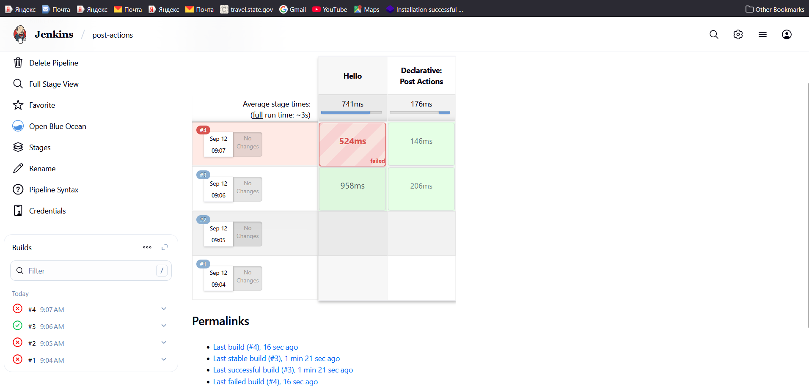

# 📘 Jenkins Pipeline Notes with Post Actions

## 🏗️ Pipeline Structure

Think of a Jenkins **Pipeline** as an **outer object** that contains multiple **inner objects**. Each of these inner objects can also have their own child objects.

### 🔑 Outer Pipeline Objects

* **agent** → Defines where the pipeline should run.
* **tools** → Defines tools like Maven, JDK, etc.
* **parameters** → Input parameters for builds.
* **environment** → Global variables.
* **stages** → Core build steps (contains multiple `stage{}` blocks).
* **post** → Actions that run after the pipeline (not tied to a specific stage).

⚠️ **Note:** Post actions should **NOT** be inside stages. They belong at the **pipeline level**.

---

## 📦 Example Pipeline

```groovy
pipeline {
    agent { label 'agent-1' }   // Use label, not any agent

    tools {
        maven 'Maven-3.9.11'
        jdk 'jdk17'
    }

    parameters {
        string(name: 'BRANCH_NAME', defaultValue: 'main', description: 'Git branch to build')
        booleanParam(name: 'RUN_TESTS', defaultValue: true, description: 'Run test cases?')
        choice(name: 'BUILD_TYPE', choices: ['debug', 'release'], description: 'Build profile')
    }

    environment {
        BUILD_STATUS = ''
    }

    stages {
        stage('Build') {
            steps {
                echo "Build type selected: ${params.BUILD_TYPE}"
                sh "mvn package -P${params.BUILD_TYPE}"
            }
        }

        stage('Trigger Job-2') {
            steps {
                build job: 'Job-2', wait: true
            }
        }
    }

    post {
        success {
            echo "✅ Pipeline is success"
        }
        failure {
            echo "❌ Pipeline is failed"
        }
        always {
            echo "📅 Job Completed at: ${new Date()}"
        }
    }
}
```
### ⚡ Meaning of wait: true
- ✅ wait: true → Jenkins will wait for Job-2 to finish before moving on.
- The result (success/failure) of Job-2 will be considered as part of the parent pipeline’s flow.
- If Job-2 fails, the parent pipeline will also fail (unless handled with catchError or similar).
- ⏭️ wait: false → Jenkins will trigger Job-2 asynchronously and immediately continue to the next step in the parent pipeline.
- The parent pipeline does not wait for Job-2’s result.
- This is useful for background jobs or fire-and-forget tasks.


🔍 Example:
```sh
stage('Trigger Job-2 and Wait') {
    steps {
        build job: 'Job-2', wait: true   // Synchronous
    }
}

stage('Trigger Job-3 without Wait') {
    steps {
        build job: 'Job-3', wait: false  // Asynchronous
    }
}
```
- Job-2 → must complete before Jenkins runs the next stage.
- Job-3 → starts, but the pipeline doesn’t wait; it continues running other stages.

## 📝 Key Takeaways

* **Post Actions:**

  * `success` → Runs only when pipeline succeeds ✅
  * `failure` → Runs only when pipeline fails ❌
  * `always` → Runs every time (success or failure) 🔄

* **Pipeline Hierarchy:**

  * Pipeline (outer object)

    * Agent
    * Tools
    * Parameters
    * Environment
    * Stages
    * Post

* **Stages:** Each stage can have its own steps, but **post** belongs to the pipeline level.

---

✨ This structure ensures your Jenkins pipeline is clean, modular, and follows best practices.


🔹 wait Default in Jenkins

If you don’t specify wait, the default is true ✅.

That means:

build job: 'Job-2'


is equivalent to:

build job: 'Job-2', wait: true


So by default, the parent waits for the downstream job to finish before moving on.
If you want asynchronous behavior, you must explicitly set wait: false.

✅ Corrected Version

wait: true (default) → Parent pauses until downstream job completes.

wait: false → Parent continues immediately, downstream runs in background.

