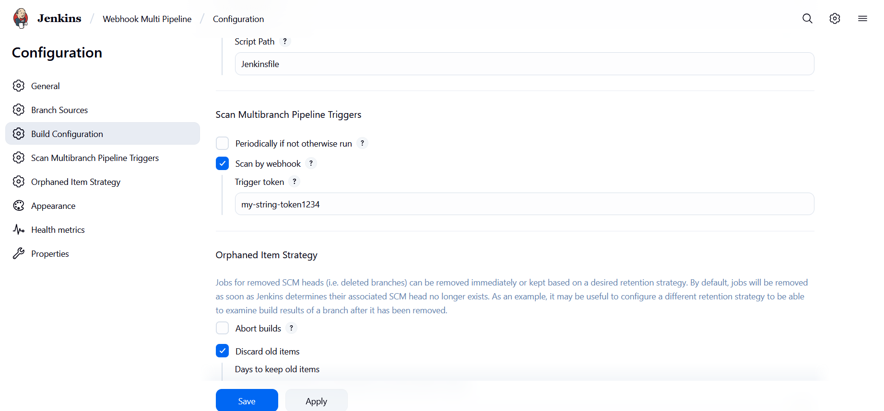

# 🔔 Jenkins Webhook Setup with GitHub — **Multibranch Pipeline**

> Goal: Create a **Multibranch Pipeline** job, connect it to **GitHub webhooks**, and make pushes trigger branch scans/builds automatically.

---

## 1️⃣ Create the Multibranch Pipeline Job 🧪

1. In Jenkins, click **New Item** → **Multibranch Pipeline** → name it (e.g., `First-MB-Pipeline`).
2. **Branch Sources** → **Add source** → choose **Git** or **GitHub**.

   * **Repository URL:** `https://github.com/<org-or-user>/<repo>.git`
   * **Credentials:** GitHub token/app with **repo** scope (for private repos).
3. **Build Configuration:** **by Jenkinsfile** (default). Ensure a `Jenkinsfile` exists in each branch you want to build.
4. **Build Strategies / Behaviors (optional):** Discover branches, PRs, etc.
5. **Save**.

---

## 2️⃣ Install / Verify Required Plugins 🧩

* **GitHub Branch Source** (recommended for GitHub repos)
* **Multibranch Scan Webhook Trigger** (to trigger scans from webhooks using a token)
* **Pipeline: Stage View** (UI)
* **Eclipse Temurin Installer** (Java provisioning for builds)

*Manage Jenkins → Plugins → Available / Installed.*

---

## 3️⃣ Enable Webhook Trigger on the Multibranch Job 🎯

Open your **Multibranch job** → **Configure** → **Scan Multibranch Pipeline Triggers**:

* ✅ Check **“Scan by webhook”** (wording may vary).
* Set **Trigger token**: a random string, e.g., `Devopsshack`.
* **Save**.

This exposes the endpoint:

```sh
http://JENKINS_URL/multibranch-webhook-trigger/invoke?token=<TriggerToken>
```
### After Installing Multibranch Scan Webhook Trigger you will scan by webhook


> Example: `http://13.233.153.254:8080/multibranch-webhook-trigger/invoke?token=my-string-token1234`

> Example: `http://23.22.182.236:8080/multibranch-webhook-trigger/invoke?token=nakod1234`

> ℹ️ **Alternative (no token):** If you rely on **GitHub Branch Source** alone, you can point GitHub to:


> [!NOTE]
Do not include `/job/<pipeline-name>/...` — that path requires a CSRF crumb and will 403.

Jenkins will verify using your GitHub app/token and auto-scan. (Good for GitHub-only setups.)

---

## 4️⃣ Configure GitHub Webhook 🐙

On the GitHub repository:

1. **Settings → Webhooks → Add webhook**
2. **Payload URL:**

   * Using Multibranch token:
     `http://23.22.182.236:8080/multibranch-webhook-trigger/invoke?token=Devopsshack`
   * Or GitHub Branch Source default:
     `http://23.22.182.236:8080/github-webhook/`
3. **Content type:** `application/json`
4. **Events:**

   * *Just the push event* ✅ (and optionally **Pull requests** if you want PRs to trigger scans/builds)
5. **Active** → **Add webhook**

> 💡 **Testing quickly:**

```sh
curl -i -X POST -H "Content-Type: application/json" -d '{}' \
  "http://13.218.118.181:8080/job/webhook-Multi-Pipeline/invoke?token=nakod1234"
```

You should see a 200 and the job should **Scan Repository Now**.

---

## 5️⃣ Jenkinsfile (Maven example with tools) ⚙️

> Ensures Maven/JDK are on `PATH` during the build to avoid `mvn: not found`.

```groovy
pipeline {
  agent any
  tools {
    jdk   'JDK17'        // must match names in Global Tool Configuration
    maven 'Maven-3.9'    // enable "Install automatically" on agents
  }
  stages {
    stage('Build') {
      steps {
        sh 'java -version && mvn -v'           // sanity
        sh 'mvn -B -ntp clean compile'
      }
    }
    stage('Test') {
      steps {
        sh 'mvn -B -ntp test'
      }
    }
  }
}
```

> 🔴 **Important:** Even if Maven is defined in **Global Tool Configuration**, the Pipeline won’t see it **unless you add a `tools { ... }` block** (Declarative) or use `tool`/`withMaven` (Scripted). Otherwise you’ll get:

```
+ mvn compile
... script.sh.copy: 1: mvn: not found
```

---

## 6️⃣ “Secret vs ID” — What goes in the URL? 🔐

* For **Multibranch Scan Webhook Trigger**, the **token is a plain string** set on the job (not a credential). Put **that value** in the webhook URL.
* If you store a token as a **Secret Text credential**, then:

  * **Secret** = the actual token string (goes in the URL as `token=`)
  * **ID** = only for selecting the credential inside Jenkins UI; **not** used in the URL

**Summary:** URL uses the **secret value**, not the credential ID.

---

## 7️⃣ Save & Test 🚀

* Click **Save** on the multibranch job.
* Push to GitHub → Webhook fires → Jenkins **scans** and builds the changed branch.
* You can also click **Scan Repository Now** to trigger manually.

---

## 🧭 Troubleshooting

* **Webhook delivers, but no scan?** Check **Multibranch job → Configure → Scan by webhook** is enabled and token matches.
* **403/404 on webhook:** Verify the URL path (`/multibranch-webhook-trigger/invoke` vs `/github-webhook/`).
* **`mvn: not found`:** Add `tools { maven '...' }` or use `withMaven`.
* **JDK mismatch errors (e.g., `NoSuchFieldError` in `com.sun.tools.javac.*`):** Use **JDK 17 LTS** and upgrade `maven-compiler-plugin` to `3.11.0` with `<release>17</release>`.

---

## ⚡ Recap

* Created a **Multibranch Pipeline** tied to a GitHub repo.
* Enabled **webhook-triggered scans** with either a **token URL** or `/github-webhook/`.
* Added a **Jenkinsfile** that sets **Maven/JDK** via `tools` to avoid PATH issues.
* Tested with curl/GitHub webhook events.

🎉 You’re ready to ship multibranch builds on every push!


Notes:

Do not include /job/<pipeline-name>/... — that path requires a CSRF crumb and will 403.

Make sure the job has Scan Multibranch Pipeline Triggers → Scan by webhook enabled and the Trigger token matches.

If Jenkins runs under a context path, include it:
http://<host>:8080/jenkins/multibranch-webhook-trigger/invoke?token=...

Alternative (no token): http://<host>:8080/github-webhook/ (with GitHub Branch Source plugin).