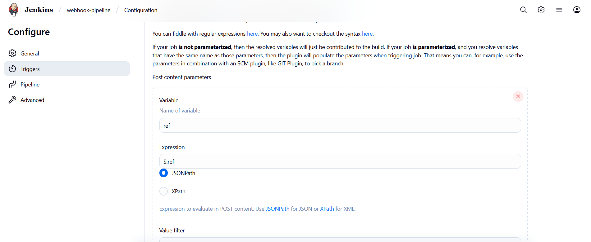
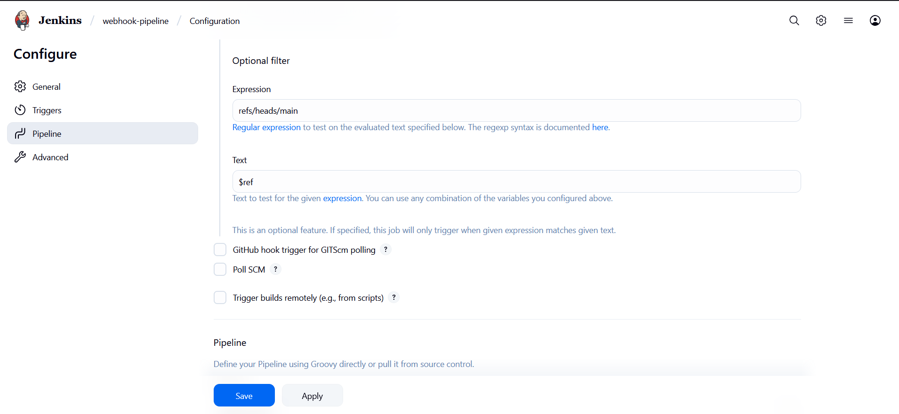
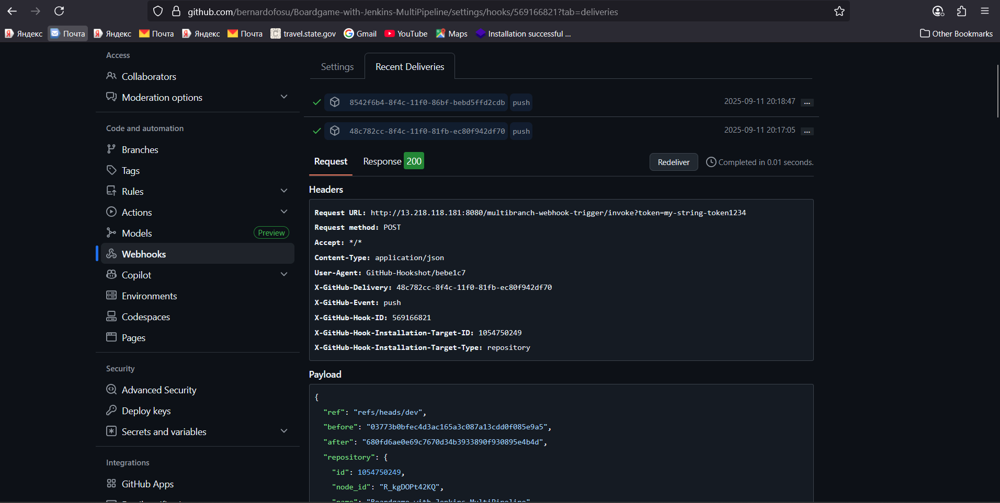
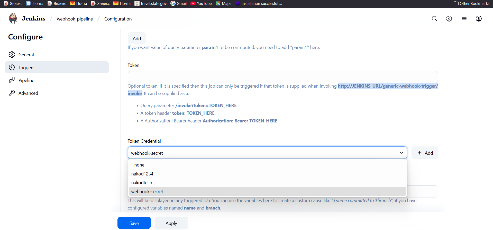

# 🌐 Jenkins Webhook Notes with Emojis

## 🔑 Key Concepts

### 📥 Webhook Payload

* Webhooks (from GitHub/GitLab/Bitbucket) send **HTTP POST requests** to Jenkins.
* These contain **JSON payloads** with info like branch (`ref`), commit SHA, repo, etc.
* Example GitHub push payload:

  ```json
  {
    "ref": "refs/heads/dev",
    "before": "03773b...",
    "after": "680fde...",
    "repository": {
      "full_name": "bernardofosu/Boardgame-with-Jenkins-MultiPipeline"
    },
    "pusher": {
      "name": "username"
    }
  }
  ```

> \[!NOTE]
> You can change the **variable name** (e.g., `ref`, `branchRef`, `reference`) to anything you like for convenience.
> But the **expression** (e.g., `$.ref`) must match the actual field name in the webhook payload. You can always verify this from **GitHub webhook deliveries**.

---

### 📝 Post Content Parameters

* Extract values from the webhook payload **before pipeline runs**.
* Example config:

  * Variable: `ref`
  * Expression: `$.ref` (JSONPath → picks `ref` field)
* Jenkins sets → `ref = "refs/heads/dev"`



---

### 🔍 Optional Filter

* Controls **whether job triggers or not**.
* Example:

  * Expression: `refs/heads/main`
  * Text: `$ref`
* Logic:

  * If `$ref = refs/heads/main` → ✅ Job triggers
  * If `$ref = refs/heads/dev` → ❌ Job skipped



👉 Without filter → job triggers on **every webhook event**.
👉 With filter → job triggers **only if condition matches**.

---

### 📌 Ref Source

* `ref` comes directly from the **webhook payload**, not from the pipeline script.
* Example: GitHub sends → `"ref": "refs/heads/dev"`
* Jenkins maps it via JSONPath → `ref = refs/heads/dev`



---

### 🔒 Token Security

* Webhook URL: `http://JENKINS_URL/generic-webhook-trigger/invoke?token=XYZ`
* Token ensures only authorized requests trigger Jenkins.
* Can also be sent via:

  * Query param → `?token=XYZ`
  * Header → `token: XYZ`
  * Authorization → `Bearer XYZ`



---

### ⚡ Using Variables in Pipeline

You can use extracted vars inside Jenkinsfile:

```groovy
pipeline {
  agent { label 'agent-1' }

  stages {
    stage('Checkout') {
      steps {
        script {
          def branchName = ref.replaceFirst('refs/heads/', '')
          echo "Building branch: ${branchName}"
          git branch: branchName, url: 'https://github.com/bernardofosu/Boardgame-with-Jenkins-MultiPipeline.git'
        }
      }
    }
  }

  post {
    success { echo '✅ Success' }
    failure { echo '❌ Failed' }
    always  { echo "📅 Completed at ${new Date()}" }
  }
}
```

---

## ✅ Summary

* **Webhook payload** = data from GitHub → JSON
* **Post content parameter** = extract values (like `ref`)
* **Optional filter** = decide when to trigger
* **Token** = secure trigger
* **Post actions in Jenkinsfile** = run after pipeline finishes (different from webhook POST)

✨ This setup makes Jenkins respond **only to the events you care about** and keeps builds clean + secure.
