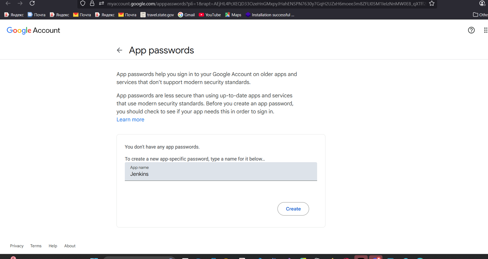

# 📧 Jenkins Mail Notifications with Gmail (Alternative)

---

## 🖥️ VM & Jenkins Setup

1. **Create Security Group (AWS SG)** 🔐
   Open ports in your AWS Security Group:

   * **22** → SSH
   * **8080** → Jenkins UI
   * **587** → SMTP (Gmail)
   * **80** → HTTP (optional if using webhooks)
   * **443** → HTTPS (optional if securing Jenkins)

2. **Launch VM & Connect via SSH** 💻

   ```bash
   ssh -i <your-key.pem> ubuntu@<EC2-Public-IP>
   ```

3. **Install Java & Jenkins (Official Source)** ☕
   [Install Java & Jenkins (Official Source)](https://www.jenkins.io/doc/book/installing/linux/#debianubuntu)

   ```sh
   sudo apt install openjdk-17-jdk -y
   ```

4. **Start Jenkins** 🚀

   ```bash
   sudo systemctl enable jenkins
   sudo systemctl start jenkins
   ```

---

## 🌐 Gmail Configuration

1. Go to **[Google Account Security](https://myaccount.google.com/security)**. 🔒
2. Enable **2-Step Verification (2FA)** 🔐.
3. Generate an **App Password** 🔑: 

   * Security → App Passwords.
   * Select **Mail** as the app and **Other** → enter “Jenkins”.
   * Copy the generated 16-character password (e.g., `abcd efgh ijkl mnop`).
  

✅ Steps to create the App Password
- In the App name box, type something like:
```sh
Jenkins
```
- Click Create.
- Google will instantly show you a 16-character password (e.g., abcd efgh ijkl mnop).
- Copy this carefully (with spaces removed).
- You won’t be able to see it again after closing the window.

⚠️ **Note:** This app password replaces your real Gmail password in Jenkins SMTP.

📌 **SMTP Details:**

* Server: `smtp.gmail.com`
* Port: `587`
* Encryption: **TLS**
* Username: [ofosubernard848@gmail.com](mailto:ofosubernard848@gmail.com)
* Password: **App Password** 🔑 



## 🔌 Jenkins Configuration

### Step 1: Install Plugins 📦

* **Email Extension Plugin**
* **Pipeline: Stage View**

### Step 2: Configure Email Notifications ✉️

1. Go to **Manage Jenkins → Configure System**.

2. Under **E-mail Notification**, configure:

   * SMTP Server: `smtp.gmail.com`
   * Port: `587`
   * ✅ Advanced → Use SMTP Authentication
   * Username: [ofosubernard848@gmail.com](mailto:ofosubernard848@gmail.com)
   * Password: *App Password* 🔑 xnww gpat yyvx hlrd 
   * ✅ Use TLS
   * Default user e-mail suffix: `@gmail.com`
   * Reply-To: `ofosubernard848@gmail.com`

3. E-mail Notification 
   * **SMTP server:** smtp.gmail.com
   * **Default user e-mail suffix:** @gmail.com
   * ✅ click on Advance: Use SMTP Authentication
   * Username: `ofosubernard848@gmail.com`
   * Password: *App Password* 🔑 tnmdgpghqjboaudl
   * **Clicked on Advanced**: Use **TLS**
   * Default user e-mail suffix: `@gmail.com`
   * **SMTP Port**: 587
   * **Reply-To Address:** `ofosubernard848@gmail.com`
  
4. Manage Jenkins → Configure System → Extended E-mail Notification → Advanced (expand) → Allow sending to unregistered users
```sh
☑ Allow sending to unregistered users # without this its still worked
```
- ➡️ If this box is not ticked, Jenkins will only send mails to addresses of Jenkins users (those registered inside Jenkins).
- ➡️ If you want to send to any email (like your Outlook), make sure this box is ticked ✅.

5. Then Default Triggers
```sh
☑ always
```
---

## 🚀 Simple Pipeline

```groovy
pipeline {
    agent any

    stages {
        stage('Test') {
            steps {
                echo "Sending test email..."
            }
        }
    }

    post {
        always {
            emailext(
                subject: "📧 Jenkins Gmail Test",
                body: "Hello, this is a plain text test email from Jenkins via Gmail!",
                $1: 'ofosubernard848@gmail.com',
                $1: 'ofosubernard848@gmail.com',
                $1: 'ofosubernard848@gmail.com'
            )
        }
    }
}
```

---

## 🚀 Jenkins Pipeline Example (with HTML)
Success
```groovy
pipeline {
    agent any

    stages {
        stage('Build') {
            steps { 
                echo 'Building...' 
            }
        }
        stage('Test') {
            steps { 
                echo 'Testing...' 
            }
        }
        stage('Deploy') {
            steps { 
                echo 'Deploying...' 
            }
        }
    }

    post {
        always {
            script {
                def jobName        = env.JOB_NAME
                def buildNumber    = env.BUILD_NUMBER
                def pipelineStatus = (currentBuild.result ?: 'UNKNOWN').toUpperCase()
                def bannerColor    = (pipelineStatus == 'SUCCESS') ? 'green' : 'red'

                def body = """
                <html>
                <body>
                  <div style="border: 4px solid ${bannerColor}; padding: 10px;">
                    <h2>${jobName} - Build ${buildNumber}</h2>
                    <div style="background-color: ${bannerColor}; padding: 10px;">
                      <h3 style="color: white;">Pipeline Status: ${pipelineStatus}</h3>
                    </div>
                    <p>Check the <a href="${env.BUILD_URL}">console output</a>.</p>
                  </div>
                </body>
                </html>
                """

                emailext(
                    subject: "${jobName} - Build ${buildNumber} - ${pipelineStatus}",
                    body: body,
                    mimeType: 'text/html',
                    to: 'ofosubernard848@gmail.com',
                    from: 'ofosubernard848@gmail.com',
                    replyTo: 'ofosubernard848@gmail.com'
                )
            }
        }
    }
}
```

Error
```groovy
pipeline {
    agent any

    stages {
        stage('Build') {
            steps { 
                echo 'Building...' 
            }
        }
        stage('Test') {
            steps { 
                echo safrgeg4g
            }
        }
        stage('Deploy') {
            steps { 
                echo 'Deploying...' 
            }
        }
    }

    post {
        always {
            script {
                def jobName        = env.JOB_NAME
                def buildNumber    = env.BUILD_NUMBER
                def pipelineStatus = (currentBuild.result ?: 'UNKNOWN').toUpperCase()
                def bannerColor    = (pipelineStatus == 'SUCCESS') ? 'green' : 'red'

                def body = """
                <html>
                <body>
                  <div style="border: 4px solid ${bannerColor}; padding: 10px;">
                    <h2>${jobName} - Build ${buildNumber}</h2>
                    <div style="background-color: ${bannerColor}; padding: 10px;">
                      <h3 style="color: white;">Pipeline Status: ${pipelineStatus}</h3>
                    </div>
                    <p>Check the <a href="${env.BUILD_URL}">console output</a>.</p>
                  </div>
                </body>
                </html>
                """

                emailext(
                    subject: "${jobName} - Build ${buildNumber} - ${pipelineStatus}",
                    body: body,
                    mimeType: 'text/html',
                    to: 'ofosubernard848@gmail.com',
                    from: 'ofosubernard848@gmail.com',
                    replyTo: 'ofosubernard848@gmail.com'
                )
            }
        }
    }
}
```

---

## 📌 Explanation

* ✅ Works with Gmail because App Passwords still allow SMTP auth.
* 🏗 **Stages** → Build, Test, Deploy.
* 🎨 **HTML Email** with dynamic banner.
* 📧 **Sender & Recipient** = Gmail address.

---

## 🛠️ Troubleshooting

1. **Authentication Error** ❌ → Make sure you’re using the **App Password**, not your Gmail password.
2. **No Email Delivered** 📭 → Check Spam/Junk folder, confirm “Allow sending to unregistered users” is ticked.
3. **TLS Error** 🔐 → Verify port is `587` and TLS is enabled.

---

✨ With this Gmail setup, Jenkins can **send notifications quickly** without complex OAuth like Outlook/Office365.
