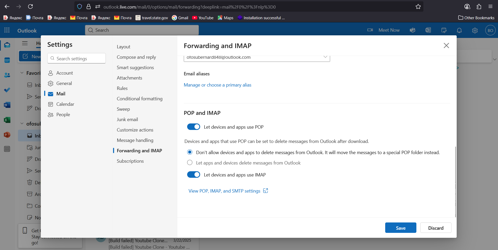

# 📧 Jenkins Mail Notifications with Outlook

---

## 🖥️ VM & Jenkins Setup

1. **Create Security Group (AWS SG)** 🔐
   Open ports in your AWS Security Group:

   * **22** → SSH
   * **8080** → Jenkins UI
   * **587** → SMTP (Outlook)
   * **80** → HTTP (optional if using webhooks)
   * **443** → HTTPS (optional if securing Jenkins)

2. **Launch VM & Connect via SSH**

   ```bash
   ssh -i <your-key.pem> ubuntu@<EC2-Public-IP>
   ```

3. **Install Java & Jenkins (Official Source)**
[Install Java & Jenkins (Official Source)](https://www.jenkins.io/doc/book/installing/linux/#debianubuntu)

```sh
sudo apt install openjdk-17-jdk -y
```

1. **Start Jenkins**

   ```bash
   sudo systemctl enable jenkins
   sudo systemctl start jenkins
   ```
 

## 🌐 Outlook Configuration

1. Use a **personal Outlook Live account** → [https://outlook.live.com](https://outlook.live.com) ✨
2. Enable **POP & IMAP**: ⚙️ → **Mail → Forwarding & IMAP**.
   

   > **IMAP** (Internet Message Access Protocol) lets Jenkins/clients send & receive mail securely.
3. Enable **2FA (Two-Factor Authentication)** 🔐 at [Microsoft Security](https://account.microsoft.com/security).
4. Generate an **App Password** 🔑 (used in Jenkins instead of your real Outlook password).

⚠️ **Note:** App passwords work only for apps (like Jenkins/SMTP), not for logging into the Outlook UI.

📌 **SMTP Details:**

* Server: `smtp.office365.com`
* Port: `587`
* Encryption: **TLS**

---

## 🔌 Jenkins Configuration

### Step 1: Install Plugins

📦 **Email Extension Plugin**
- 

📦 **Pipeline: Stage View**
 - The plugin gives you a visual dashboard of your pipeline’s stages and their results

### Step 2: Configure Email Notifications

1. Go to **Manage Jenkins → Configure System**.
2. Under **Extended E-mail Notification**, configure:

   * SMTP Server: `smtp.office365.com`
   * Port: `587`
   * ✅ click on Advance: Use SMTP Authentication
   * Username: `ofosubernard848@outlook.com`
   * Password: *App Password* 🔑 tnmdgpghqjboaudl
   * ✅ Use TLS
   * Default user e-mail suffix: `@outlook.com`
   * Reply-To: `ofosubernard848@outlook.com`

3. E-mail Notification 
   * **SMTP server:** smtp.office365.com
   * **Default user e-mail suffix:**
   * ✅ click on Advance: Use SMTP Authentication
   * Username: `ofosubernard848@outlook.com`
   * Password: *App Password* 🔑 tnmdgpghqjboaudl
   * **Clicked on Advanced**: Use **TLS**
   * Default user e-mail suffix: `@outlook.com`
   * **SMTP Port**: 
   * **Reply-To Address:** `ofosubernard848@outlook.com`
  
4. Manage Jenkins → Configure System → Extended E-mail Notification → Advanced (expand) → Allow sending to unregistered users
```sh
☑ Allow sending to unregistered users
```
- ➡️ If this box is not ticked, Jenkins will only send mails to addresses of Jenkins users (those registered inside Jenkins).
- ➡️ If you want to send to any email (like your Outlook), make sure this box is ticked ✅.

5. Then Default Triggers
```sh
☑ always
```

### Step 3: Test Email ✅

* Scroll to **Send Test E-mail**.
* Recipient: `ofosubernard848@outlook.com`.
* Send → 🎉 Success = Setup complete.

Simple Pipeline
```sh
pipeline {
    agent any

    stages {
        stage('Test') {
            steps {
                echo "Sending test email..."
            }
        }
    }

    post {
        always {
            emailext(
                subject: "📧 Jenkins Email Test",
                body: "Hello, this is a plain text test email from Jenkins!",
                to: 'ofosubernard848@outlook.com',
                from: 'ofosubernard848@outlook.com',   // added
                replyTo: 'ofosubernard848@outlook.com' // added
            )
        }
    }
}
```

## 🚀 Jenkins Pipeline Example

```groovy
pipeline {
    agent any

    stages {
        stage('Build') {
            steps {
                echo 'Building...'
            }
        }
        stage('Test') {
            steps {
                echo 'Testing...'
            }
        }
        stage('Deploy') {
            steps {
                echo 'Deploying...'
            }
        }
    }

    post {
        always {
            script {
                def jobName = env.JOB_NAME
                def buildNumber = env.BUILD_NUMBER
                def pipelineStatus = currentBuild.result ?: 'UNKNOWN'
                def bannerColor = pipelineStatus.toUpperCase() == 'SUCCESS' ? 'green' : 'red'

                def body = """
                    <html>
                    <body>
                    <div style="border: 4px solid ${bannerColor}; padding: 10px;">
                    <h2>${jobName} - Build ${buildNumber}</h2>
                    <div style="background-color: ${bannerColor}; padding: 10px;">
                    <h3 style="color: white;">Pipeline Status: ${pipelineStatus.toUpperCase()}</h3>
                    </div>
                    <p>Check the <a href="${env.BUILD_URL}">console output</a>.</p>
                    </div>
                    </body>
                    </html>
                """

                emailext (
                    subject: "${jobName} - Build ${buildNumber} - ${pipelineStatus.toUpperCase()}",
                    body: body,
                    to: 'ofosubernard848@outlook.com',
                    from: 'ofosubernard848@outlook.com',
                    replyTo: 'ofosubernard848@outlook.com',
                    mimeType: 'text/html'
                )
            }
        }
    }
}
```

---

## 📌 Explanation

* 🏗 **Stages** → Build, Test, Deploy.
* 📬 **Post Actions** → Always send email after pipeline run.
* 🎨 **Dynamic Email Body** →

  * Green banner ✅ = success
  * Red banner ❌ = failure
  * Includes job details + console output link.
* 📧 **Sender & Recipient** → `ofosubernard848@outlook.com`.

---

## 🛠️ Troubleshooting

1. **SMTP Authentication Error** ❌

   * Check App Password & Port.

2. **Email Not Sent** 📭

   * Verify TLS is enabled.
   * Check Jenkins logs.
   * Confirm correct Outlook SMTP setup.

---

✨ With this setup, Jenkins securely sends **pipeline notifications** to your Outlook inbox 📩.
