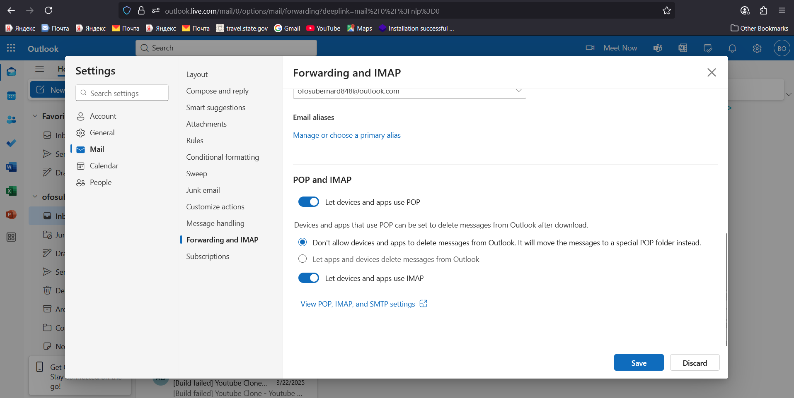

# 📧 Jenkins Mail Notifications with Outlook

---

## 🖥️ VM & Jenkins Setup

1. **Create Security Group (AWS SG)** 🔐
   Open ports in your AWS Security Group:

   * **22** → SSH
   * **8080** → Jenkins UI
   * **587** → SMTP (Outlook)
   * **80** → HTTP (optional if using webhooks)
   * **443** → HTTPS (optional if securing Jenkins)

2. **Launch VM & Connect via SSH**

   ```bash
   ssh -i <your-key.pem> ubuntu@<EC2-Public-IP>
   ```

3. **Install Java & Jenkins (Official Source)**

   ```bash
   sudo apt update -y
   sudo apt install openjdk-17-jdk -y

   curl -fsSL https://pkg.jenkins.io/debian/jenkins.io-2023.key | sudo tee \
       /usr/share/keyrings/jenkins-keyring.asc > /dev/null
   echo deb [signed-by=/usr/share/keyrings/jenkins-keyring.asc] \
       https://pkg.jenkins.io/debian binary/ | sudo tee \
       /etc/apt/sources.list.d/jenkins.list > /dev/null

   sudo apt update -y
   sudo apt install jenkins -y
   ```

4. **Start Jenkins**

   ```bash
   sudo systemctl enable jenkins
   sudo systemctl start jenkins
   ```

---

## 🌐 Outlook Account Setup

* Use a **personal Outlook Live account** → `https://outlook.live.com`
* Enable **IMAP**:
  
* **IMAP meaning** → Internet Message Access Protocol, allows Jenkins (or any mail client) to communicate securely with Outlook servers.

---

## 🔒 Security Setup

* Normal password ❌ (not secure).
* Enable **Two-Factor Authentication (2FA)** ✅ → [Microsoft Security](https://account.microsoft.com/security)
* Generate an **App Password** 🔑 (used in Jenkins instead of your real password).

⚠️ Note: App passwords cannot be used to log into Outlook UI, only apps like Jenkins.

---

## 🔌 Jenkins Plugin Setup

1. Install Jenkins Plugins:

   * **Email Extension Plugin**
   * **Pipeline: Stage View**

2. Configure Jenkins **E-mail Notification** under **Manage Jenkins → System**:

   * SMTP server: `smtp.office365.com`
   * Port: `587`
   * TLS: ✅
   * Credentials:

     * Username: `ofosubernard848@outlook.com`
     * Password: *App Password*
   * Default user suffix: `@outlook.com`
   * Reply-to: `ofosubernard848@outlook.com`

---

## 🚀 Jenkins Pipeline Example

```groovy
pipeline {
    agent any

    stages {
        stage('Build') {
            steps {
                echo 'Building project...'
            }
        }

        stage('Test') {
            steps {
                echo 'Running tests...'
            }
        }
    }

    post {
        success {
            mail to: 'ofosubernard848@outlook.com',
                 subject: "✅ Jenkins Job Success: ${env.JOB_NAME}",
                 body: "Build #${env.BUILD_NUMBER} completed successfully!"
        }
        failure {
            mail to: 'ofosubernard848@outlook.com',
                 subject: "❌ Jenkins Job Failed: ${env.JOB_NAME}",
                 body: "Build #${env.BUILD_NUMBER} failed. Check logs."
        }
        always {
            echo "📬 Email Notification Sent"
        }
    }
}
```

---

## ✅ Key Notes

* 📡 **SMTP Port** = 587 (TLS)
* 🔑 **App Password** → must be used instead of real password
* 📧 **Default email suffix** = `@outlook.com`
* 🔔 **Trigger** → pipeline `post {}` bl
