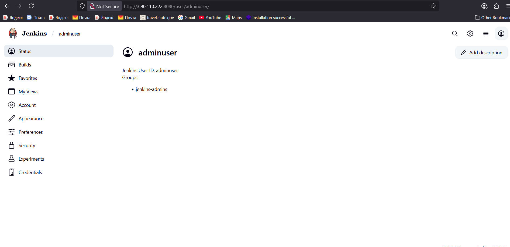

# 🔐 Complete RBAC Setup in Jenkins with OpenLDAP

## 🧠 Why groups (RBAC)?

Giving permissions to **groups** (roles) and then adding **users** to those groups is scalable:

* Remove a user from a group ➜ all permissions are revoked at once.
* Easier audits & fewer mistakes than granting permissions user‑by‑user.

[openLDAP](./openLDAP.md)

## 🏗️ Architecture & Ports

* Jenkins ⇄ **LDAP/LDAPS** (OpenLDAP)
* Ports: **389** (LDAP), **636** (LDAPS). Open in your AWS SG. Also open **22** (SSH) to manage the VM and Port 8080 for Jenkins


## 📌 Phase 1: OpenLDAP Setup with Users & Groups

### 🔎 What is OpenLDAP?

* Open-source implementation of **LDAP** (Lightweight Directory Access Protocol).
* Stores and manages **users, groups, and access control** centrally.
* Acts like a **database for identity management** that Jenkins connects to for authentication.

---

### 🖥️ Step 1: Install OpenLDAP on EC2

```bash
sudo apt-get update
sudo apt-get install slapd ldap-utils -y
```

* **slapd** → OpenLDAP server daemon.
* **ldap-utils** → Tools for managing LDAP (ldapadd, ldapsearch, etc.).

---

### ⚙️ Step 2: Configure OpenLDAP (Interactive)

```bash
sudo dpkg-reconfigure slapd
```

| Prompt              | Explanation                               | Input         |
| ------------------- | ----------------------------------------- | ------------- |
| Omit config?        | Configure manually                        | No            |
| DNS domain          | Defines LDAP domain (dc=nakodtech,dc=com) | nakodtech.com |
| Organization        | Label for organization                    | NakodTech     |
| Admin password      | LDAP admin password                       | your password |
| Database backend    | Recommended                               | MDB           |
| Remove DB on purge? | Prevents deletion                         | No            |
| Move old DB?        | If configs exist                          | Yes           |

---

### 🌳 Step 3: Base DIT (Directory Information Tree)

Step 3: Base Directory Information Tree (DIT)
What is DIT?
• DIT (Directory Information Tree) is the hierarchical structure of your LDAP database.
• It’s like a file system hierarchy, but for identity data.
• The base DN (Distinguished Name) here is dc=nakodtech,dc=com.

---

###  Use this set of script if u haven’t created the domain during the slapd config

File: base.ldif
```sh
vi base.ldif
```

```ldif
dn: dc=nakodtech,dc=com
objectClass: top
objectClass: domain
dc: nakodtech

dn: ou=users,dc=nakodtech,dc=com
objectClass: organizationalUnit
ou: users

dn: ou=groups,dc=nakodtech,dc=com
objectClass: organizationalUnit
ou: groups
```
### When you install slapd and go through the interactive popup (sudo dpkg-reconfigure slapd), you already tell OpenLDAP your domain (e.g., nakodtech.com).

That step automatically creates the base DN:
```sh
dn: dc=nakodtech,dc=com
objectClass: top
objectClass: domain
dc: nakodtech
```
So ✅ you don’t need to add it again in your base.ldif.
From there, you only need to add the child OUs (users, groups):

If already created then use these
```sh
vi base.ldif
```
```ldif
dn: ou=users,dc=nakodtech,dc=com
objectClass: organizationalUnit
ou: users

dn: ou=groups,dc=nakodtech,dc=com
objectClass: organizationalUnit
ou: groups
```

# 🌳 LDAP DIT Elements

| 🏷️ Element             | 📌 Purpose                                      |
|-------------------------|------------------------------------------------|
| `dc=nakodtech,dc=com`  | 🌐 Root of the LDAP hierarchy (base domain)     |
| `ou=users`             | 👤 Organizational Unit (OU) for user entries   |
| `ou=groups`            | 👥 OU to store group entries                   |


📌 Command:

```bash
ldapadd -x -D "cn=admin,dc=nakodtech,dc=com" -W -f base.ldif
```
Enter your password `nakod1234` and you will see;
```sh
adding new entry "ou=users,dc=nakodtech,dc=com"

adding new entry "ou=groups,dc=nakodtech,dc=com"
```
✅ So this command = “Log in as admin, read base.ldif, and add those entries into the LDAP server.”


### 👥 Step 4: Create Users

📂 File: **users.ldif**
```sh
vi users.ldif
```

```ldif
dn: uid=adminuser,ou=users,dc=nakodtech,dc=com
objectClass: inetOrgPerson
uid: adminuser
sn: Admin
cn: Admin User
userPassword: adminpass


dn: uid=adminuser1,ou=users,dc=nakodtech,dc=com
objectClass: inetOrgPerson
uid: adminuser1
sn: Admin1
cn: Admin1 User
userPassword: adminpass1

dn: uid=devuser1,ou=users,dc=nakodtech,dc=com
objectClass: inetOrgPerson
uid: devuser1
sn: Developer1
cn: Dev User1
userPassword: devpass1

dn: uid=devuser2,ou=users,dc=nakodtech,dc=com
objectClass: inetOrgPerson
uid: devuser2
sn: Developer2
cn: Dev User2
userPassword: devpass2

dn: uid=viewer1,ou=users,dc=nakodtech,dc=com
objectClass: inetOrgPerson
uid: viewer1
sn: Viewer1
cn: Viewer User1
userPassword: viewerpass1
```

📌 Command:

```bash
ldapadd -x -D "cn=admin,dc=nakodtech,dc=com" -W -f users.ldif
```
Enter your password `nakod1234` and you will see;
```sh
adding new entry "uid=adminuser,ou=users,dc=nakodtech,dc=com"

adding new entry "uid=devuser1,ou=users,dc=nakodtech,dc=com"

adding new entry "uid=devuser2,ou=users,dc=nakodtech,dc=com"

adding new entry "uid=viewer1,ou=users,dc=nakodtech,dc=com"
```
### Explanation
- DN: Full path in the directory tree.
- uid: Login username (devuser1).
- cn: Full common name (Dev User1).
- sn: Surname (Developer1).
userPassword: Credential (stored usually as a hash, not plaintext).

### ✅ So yes, OpenLDAP entries often have both uid and cn.
- uid = technical login name.
- cn = human-readable full name.
- In Active Directory, by contrast:
Microsoft often uses cn (Common Name) and sAMAccountName (login name).

OpenLDAP uses uid for login, but still includes cn for clarity.

### 🏷️ Step 5: Create Groups

📂 File: **groups.ldif**
```sh
vi groups.ldif
```

```ldif
dn: cn=jenkins-admins,ou=groups,dc=nakodtech,dc=com
objectClass: groupOfNames
cn: jenkins-admins
member: uid=adminuser,ou=users,dc=nakodtech,dc=com

dn: cn=jenkins-devs,ou=groups,dc=nakodtech,dc=com
objectClass: groupOfNames
cn: jenkins-devs
member: uid=devuser1,ou=users,dc=nakodtech,dc=com
member: uid=devuser2,ou=users,dc=nakodtech,dc=com

dn: cn=jenkins-viewers,ou=groups,dc=nakodtech,dc=com
objectClass: groupOfNames
cn: jenkins-viewers
member: uid=viewer1,ou=users,dc=nakodtech,dc=com
```

📌 Command:

```bash
ldapadd -x -D "cn=admin,dc=nakodtech,dc=com" -W -f groups.ldif
```
Enter your password `nakod1234` and you will see;
```sh
adding new entry "cn=jenkins-admins,ou=groups,dc=nakodtech,dc=com"

adding new entry "cn=jenkins-devs,ou=groups,dc=nakodtech,dc=com"

adding new entry "cn=jenkins-viewers,ou=groups,dc=nakodtech,dc=com"
```
---

### 🔍 Step 6: Verify Directory

```bash
ldapsearch -x -b "dc=nakodtech,dc=com"
```

---

## 📌 Phase 2: Jenkins RBAC with OpenLDAP

### 📦 Step 1: Install LDAP Plugin

* Manage Jenkins → Manage Plugins → Available → **LDAP Plugin**

[Jenkins – Recommended Production Permissions (LDAP)](./Jenkins%20–%20Recommended%20Production%20Permissions%20(LDAP).md)

### ⚙️ Step 2: Configure LDAP Authentication

Manage Jenkins → Security → Security Realm → **LDAP**

| Field                   | Value                        | Explanation          |
| ----------------------- | ---------------------------- | -------------------- |
| Server                  | ldap://<LDAP-IP>:389     | LDAP server & port   |
| Root DN                 | dc=nakodtech,dc=com          | Root directory       |
| User Search Base        | ou=users                     | Where users live     |
| User Search Filter      | (uid={0})                    | {0} = login username |
| Group Search Base       | ou=groups                    | Where groups live    |
| Group Membership Filter | (member={0})                 | {0} = user DN        |
| Manager DN              | cn=admin,dc=nakodtech,dc=com | LDAP bind account    |
| Manager Password        | (your password)              | Bind password        |
> [!NOTE]
> If the LDAP Server is in the same VPC you can use the private IP but if use public and its change you will get this [erro](jenkins_ldap_private_ip_fix.md)


Where to see you above config on the jenkins server
```sh
sudo nano /var/lib/jenkins/config.xml
```

✅ Test with `adminuser/adminpass`.

- tick Search for LDAP groups containing user you will see Group membership filter
  
replace ip ldap://3.110.123.68:389 with ur vm ip

### Test connection
```sh
User: adminuser
Password: adminpass
```

Why?
- Your Jenkins user filter is (uid={0}), so it searches by uid.
- adminuser is a member of jenkins-admins, so the “reverse group lookup” part of the test will also pass.

### 🔑 Step 3: Configure Jenkins Authorization (RBAC)

Go to
- Manage Jenkins
- Security
- Authorization and choose Matrix-based Security (Recommended)

Note: Project based authoriztion Strategy is limited to project

#### ✅ Option A: Matrix-based Security (Small Project)
The we click on add groups

| Identity         | Permissions               |
| ---------------- | ------------------------- |
| @jenkins-admins  | ✔️ Administer             |
| @jenkins-devs    | ✔️ Job Read, ✔️ Job Build |
| @jenkins-viewers | ✔️ Job Read               |

💡 `@` prefix = LDAP groups.

✨ Summary:
- Use jenkins-admins (no @) in UI.
- Jenkins will internally prefix it with GROUP: in config.xml.
- Reserve adminuser (no GROUP:) for your own user account.


#### ✅ Option B: Role Strategy Plugin (Big Projects)

* Install Role-based Authorization Strategy.
* Define roles (admin/dev/viewer).
* Map LDAP groups.

---

## 📂 Files Recap

* **base.ldif** → Root DN + OUs (users & groups).
* **users.ldif** → User accounts.
* **groups.ldif** → Groups with members.

---

## 📝 Jenkins Config Summary

* **Security Realm**: LDAP (OpenLDAP auth).
* **Authorization**: Matrix-based security.
* **Groups**: jenkins-admins, jenkins-devs, jenkins-viewers.
* **Users**: adminuser, devuser1, devuser2, viewer1.

🚀 With this setup → Jenkins authenticates via OpenLDAP, and RBAC is enforced through LDAP groups!


# 📑 LDAP `.ldif` Attribute Cheat Sheet

| 🔑 Attribute | 📝 Full Meaning       | 📌 Description                                                            | 🌍 Example |
|--------------|----------------------|---------------------------------------------------------------------------|------------|
| **dn**       | Distinguished Name   | Unique path of an entry in the LDAP tree. It tells LDAP where this entry lives. | `dn: uid=devuser1,ou=users,dc=nakodtech,dc=com` |
| **dc**       | Domain Component     | Each part of a domain name in LDAP form. Multiple `dc` values form the root. | `dc=nakodtech,dc=com → nakodtech.com` |
| **ou**       | Organizational Unit  | A container used to group related entries (like folders).                  | `ou=users`, `ou=groups` |
| **cn**       | Common Name          | A human-readable name for the object. Often the full name of a user or group. | `cn: Admin User`, `cn: jenkins-admins` |
| **sn**       | Surname              | User’s last name (family name). Required for `inetOrgPerson`.             | `sn: Ofosu` |
| **uid**      | User ID              | Login identifier for a user. Must be unique under the `ou=users`.         | `uid: devuser1` |

---

## ✨ Quick Notes
- 📂 `.ldif` files are how you **add/import data** into LDAP (`ldapadd -f users.ldif`).  
- 🔑 Each entry inside starts with a **dn**, then lists **object classes + attributes**.  
- 📊 Think of `.ldif` as the **CSV of LDAP** — simple, structured, and importable.  

👉 Example `.ldif` entry:

```ldif
dn: uid=devuser1,ou=users,dc=nakodtech,dc=com
objectClass: inetOrgPerson
uid: devuser1
sn: Ofosu
cn: Dev User1
userPassword: devpass1
```

## ✅ Best Practice
Always keep one explicit user (e.g., adminuser) with Administer → safety net.
- Use groups for day-to-day permissions → scales better.
- jenkins-admins → full control.
- jenkins-devs → read/build.
 jenkins-viewers → read-only.

### 🚦 In Your Case
- Since adminuser already belongs to jenkins-admins, in theory you could delete it from the table.
- But it’s smart to keep it there as a direct admin fallback in case LDAP group lookups break.