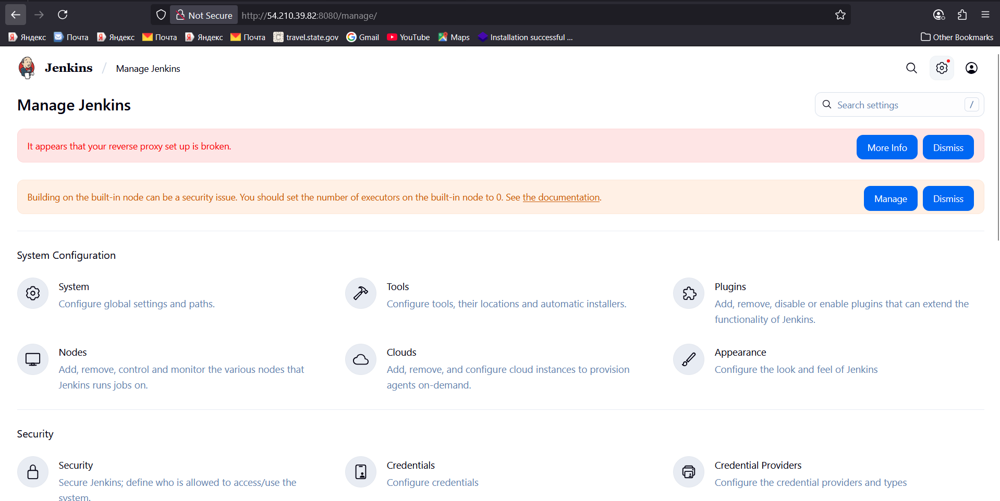

Because the SSH launcher needs java on the target machine to run the agent (remoting.jar).
Your log shows:
```sh
bash: line 1: java: command not found
Agent JVM has terminated. Exit code=127
```

So either Java isn’t installed on the agent host, or it isn’t in PATH for non-interactive SSH sessions.

Quick fix (Ubuntu)
# on the agent host (the machine Jenkins SSHes into)
sudo apt-get update
sudo apt-get install -y openjdk-17-jre-headless

# sanity check
which java
java -version
# make sure /home/ubuntu/jenkins exists & is writable
mkdir -p /home/ubuntu/jenkins


Then in Jenkins → Manage Jenkins → Nodes → your SSH node → Configure:

Ensure Remote root directory = /home/ubuntu/jenkins

(Optional but safest) set Java Path to /usr/bin/java


Headless = no GUI bits (no X11/AWT/fonts). Perfect for servers.

For a Jenkins SSH agent that only runs remoting.jar, JRE headless is enough.

If the agent will compile/build (Maven/Gradle, javac), install the JDK headless instead.


# 🛠️ Jenkins Reverse Proxy Warning & Public IP Changes (Learning Setup)


Very Important error not to overlooked becuase it will slow down your jenkins server

## 🧩 Symptoms

```
Manage Jenkins → System diagnostics

It appears that your reverse proxy setup is broken
This message can also appear if you don’t access Jenkins through a reverse proxy:
Make sure the Jenkins URL configured in the System Configuration matches the URL you’re using to access Jenkins.
```

## 🤔 What this really means

Jenkins is generating links using the **Jenkins URL** you set in **Manage Jenkins → System → Jenkins URL**. If your **EC2 public IP changes**, that URL becomes wrong. Then the browser tries to load CSS/JS/WebSocket from the **old address**, causing timeouts and a very **slow UI**.

> 🔴 **Very important:** Update the **Jenkins URL** whenever your instance’s **public IP** changes to avoid sluggish behavior and broken links.

---

## ✅ Quick Fix (Every time the public IP changes)

1. **Find the current public IP** of the controller:

   * From the controller host:

     ```bash
     curl -s http://checkip.amazonaws.com
     ```
   * Or in AWS Console → **EC2 → Instances → Public IPv4 address**
2. Open **Jenkins** in your browser (using that new IP):

   * `http://<NEW_PUBLIC_IP>:8080/`
     *(Add `/jenkins/` if you run behind a context path)*
3. Go to **Manage Jenkins → System**.
4. In **Jenkins URL**, paste the exact URL you use in the browser, e.g.:

   * `http://<NEW_PUBLIC_IP>:8080/`
   * or `https://<your-domain>/jenkins/` (if you use a reverse proxy + TLS)
5. **Save**.
6. Reload the **Manage Jenkins** page. The warning should disappear.

> 💡 If you’re **not** using a reverse proxy at all, simply set the Jenkins URL to the direct address you actually visit (usually `http://<PUBLIC_IP>:8080/`).

---

## 🧭 Context Path (if you proxy under /jenkins)

* If you access Jenkins at `https://example.com/jenkins/`, make sure **both** are aligned:

  * Jenkins runs with `--prefix=/jenkins`
  * **Jenkins URL** is `https://example.com/jenkins/` (note the trailing slash)

---

## 🧪 Sanity Checks

* **From a client:**

  ```bash
  curl -I http://<NEW_PUBLIC_IP>:8080/login
  # Expect 200 OK (or 403 if unauthorized), but NOT a redirect to an old IP/URL
  ```
* **In the browser devtools → Network tab:** ensure CSS/JS requests point to the **new** IP/URL, not the old one.

---

## ⚡ Optional: Update via Script Console (Advanced)

If you prefer to change the URL programmatically (useful for quick updates during learning):

1. Open **Manage Jenkins → Script Console**
2. Run:

```groovy
import jenkins.model.JenkinsLocationConfiguration

def jlc = JenkinsLocationConfiguration.get()
jlc.setUrl("http://<NEW_PUBLIC_IP>:8080/")
jlc.save()
println "Jenkins URL updated to: ${jlc.getUrl()}"
```

*(Replace with your exact URL. If you use a context path, include the trailing slash, e.g., `https://example.com/jenkins/`.)*

---

## 📌 Very Important Notes

* 🧭 **Always update the Jenkins URL after a public IP change.**
* 🐢 **Slow UI = stale URL** (browser fetching assets from an old address → timeouts).
* 🔒 If you use a reverse proxy (Nginx/ALB/Apache), ensure it sets `X-Forwarded-Proto`, `X-Forwarded-Port`, and preserves the `Host` header.
* 🧩 Keep the **context path** consistent (`--prefix=/jenkins` if you proxy at `/jenkins`).

---

## 🧯 Troubleshooting Quick List

* ✅ **Jenkins URL** matches what you type in the browser (scheme/host/port/path)
* ✅ No redirects to old hosts/ports in `curl -I` responses
* ✅ Proxy headers present (if using a reverse proxy):

  * `X-Forwarded-Proto` = `https` when TLS terminates at the proxy
  * `X-Forwarded-Port` matches external port (443/80)
  * `Host` header is preserved
* ✅ If using agents, their SSH settings can use **private IPs** (independent of Jenkins URL)

---

## 🚀 Nice-to-have (when you move beyond learning)

* 📎 **Elastic IP** for the controller → the IP doesn’t change
* 🌐 **DNS (Route 53)** pointing a domain (e.g., `ci.example.com`) to the EIP
* 🔐 HTTPS via Nginx/ALB + Let’s Encrypt, and set **Jenkins URL** to `https://ci.example.com/`

---

## 📝 TL;DR

> **If your EC2 public IP changes, immediately update `Manage Jenkins → System → Jenkins URL` to the new address.**
> This prevents slow loading and removes the “reverse proxy setup is broken” warning. 🟢


## ❗️Pipeline Errors & Fixes (from your run)

### 🔴 Error 1 — Maven not found

```text
+ mvn compile
/home/ubuntu/jenkins/workspace/First-Pipeline@tmp/durable-325398d6/script.sh.copy: 1: mvn: not found
```

**Cause:** The pipeline didn’t add Jenkins’ Maven tool to the PATH, so the agent can’t find `mvn`.

**Fix (Declarative Pipeline):** add a `tools` block so Jenkins injects Maven & JDK into PATH.

```groovy
pipeline {
  agent { label 'agent-1' }
  tools {
    maven 'Maven-3.9.11'   // Manage Jenkins → Tools → Maven installations
    jdk   'jdk17'          // or 'jdk11' if required
  }
  stages {
    stage('Build') {
      steps {
        sh 'mvn -v'
        sh 'mvn -B compile'
      }
    }
  }
}
```

*Scripted alternative:* install tools in Jenkins and run within `withMaven(maven: 'Maven-3.9.11') { ... }` or use the repo’s `./mvnw` wrapper.

---

### 🔴 Error 2 — JDK / `javac` API mismatch

```text
[ERROR] Failed to execute goal org.apache.maven.plugins:maven-compiler-plugin:3.8.1:compile (default-compile)
[ERROR] Fatal error compiling: java.lang.NoSuchFieldError: Class com.sun.tools.javac.tree.JCTree$JCImport does not have member field 'com.sun.tools.javac.tree.JCTree qualid'
```

**Cause:** Project is built for **Java 11 or 17**, but the build was running with a newer `javac` (e.g., JDK 21), or with old processors/plugins.

**Fix:** Use a matching JDK for this project — **JDK 11 or 17**.

* Ensure both are installed via the **Eclipse Temurin installer** plugin (Tools → JDK): `jdk11`, `jdk17`.
* Select the required one in the pipeline `tools` block (see above).
* Optional (if upgrading to newer JDK): update `maven-compiler-plugin` (≥3.11.0) and annotation processors (e.g., Lombok) in `pom.xml`.

**Sanity check step:**

```groovy
sh 'echo JAVA_HOME=$JAVA_HOME; java -version; mvn -v'
```

**Result:** Pipeline knows about the installed tools, `mvn` is on PATH, and compilation uses the correct JDK (11/17) for the project.
